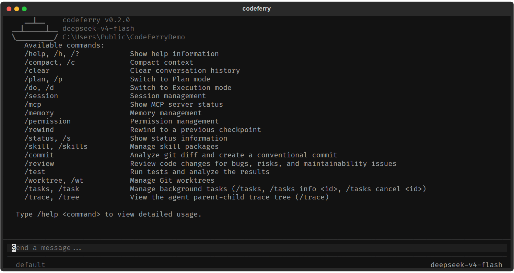
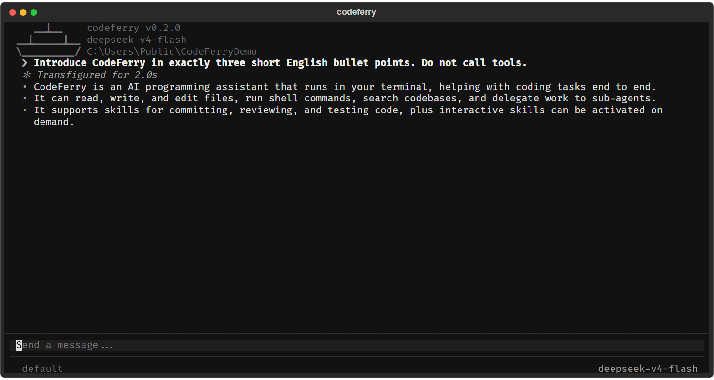
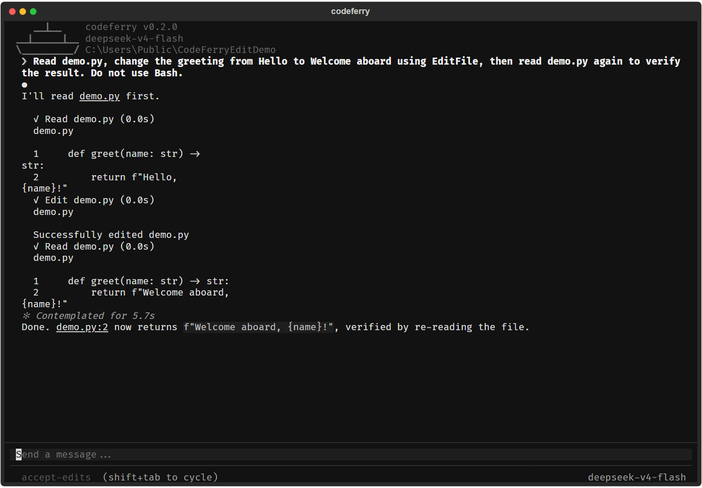

# CodeFerry

CodeFerry is a terminal-native AI coding assistant that brings language models, code editing, command execution, permission controls, persistent sessions, memory, skills, sub-agents, Git worktrees, hooks, and MCP tools into one interactive interface.

It is built with Python and Textual and supports DeepSeek, OpenAI, Anthropic, and OpenAI-compatible Chat Completions providers.

> Current version: `0.2.0`
>
> Python: `3.11+`
>
> Test status: `547 passed, 1 skipped`

## Screenshots

Command overview:



Live conversation using the DeepSeek API:



Reading, editing, and verifying code:



## Highlights

- **Interactive terminal UI** with streaming responses, tool-call rendering, command completion, permission dialogs, and session restore.
- **Complete agent loop** that can read, search, edit, and validate code, as well as run shell commands.
- **Multiple model providers** including DeepSeek, OpenAI, Anthropic, and OpenAI-compatible services.
- **Layered permission system** for reads, writes, and commands, with dangerous-command detection and path sandboxing.
- **Sessions and memory** with resumable conversations, context compaction, and long-term memory recall.
- **Skills and sub-agents** defined in Markdown, including independent workers and coordinated agent teams.
- **Git worktree isolation** for parallel work and experiments that should not modify the primary checkout.
- **MCP integration** for dynamically connecting external tools and services.
- **Lifecycle hooks** for sessions, prompts, tool calls, file changes, errors, and other events.
- **Non-interactive mode** for scripts, automation, and CI workflows.

## One-Command Deployment

The deployment scripts automatically:

1. Check the installed Python version.
2. Create a `.venv` virtual environment.
3. Bootstrap `pip` when the environment was created by `uv` without it.
4. Install CodeFerry and its dependencies.
5. Create a DeepSeek configuration template when no configuration exists.
6. Validate the API key and model client.
7. Start CodeFerry.

The scripts are safe to run repeatedly and never overwrite an existing `.codeferry/config.yaml`.

### Windows

Double-click the following file in File Explorer:

```text
deploy.bat
```

Or run it from PowerShell:

```powershell
cd C:\path\to\CodeFerry
.\deploy.ps1
```

Deploy without starting the UI:

```powershell
.\deploy.ps1 -NoRun
```

Skip dependency installation when the environment is already prepared:

```powershell
.\deploy.ps1 -SkipInstall
```

### Linux and macOS

```bash
cd /path/to/CodeFerry
chmod +x deploy.sh
./deploy.sh
```

Deploy without starting the UI:

```bash
./deploy.sh --no-run
```

Skip dependency installation:

```bash
./deploy.sh --skip-install
```

## Manual Installation

### Using uv

```bash
uv sync
uv run codeferry
```

### Using Python venv

Windows PowerShell:

```powershell
python -m venv .venv
.\.venv\Scripts\python.exe -m pip install -e .
.\.venv\Scripts\python.exe -m codeferry
```

Linux and macOS:

```bash
python3 -m venv .venv
./.venv/bin/python -m pip install -e .
./.venv/bin/python -m codeferry
```

## Model Configuration

The deployment scripts generate a DeepSeek configuration by default. In most cases, only the API key needs to be set:

```powershell
$env:OPENAI_API_KEY = "your DeepSeek API key"
```

The default provider configuration is stored in `.codeferry/config.yaml`:

```yaml
providers:
  - name: deepseek
    protocol: openai-compat
    base_url: https://api.deepseek.com
    model: deepseek-v4-flash
    api_key: ""
```

To switch providers, update this provider block:

| Provider | `protocol` | `base_url` | API key environment variable |
| --- | --- | --- | --- |
| DeepSeek | `openai-compat` | `https://api.deepseek.com` | `OPENAI_API_KEY` |
| OpenAI | `openai` | `https://api.openai.com/v1` | `OPENAI_API_KEY` |
| Anthropic | `anthropic` | `https://api.anthropic.com` | `ANTHROPIC_API_KEY` |
| Ollama or another compatible service | `openai-compat` | The provider's compatible endpoint | `OPENAI_API_KEY` |

Configuration is loaded in the following order, with later files taking precedence:

```text
~/.codeferry/config.yaml
<project>/.codeferry/config.yaml
<project>/.codeferry/config.local.yaml
```

An API key may also be placed directly in the `api_key` field, but environment variables are safer. Never commit or publish a real API key.

## Usage

### Interactive UI

After installation, run:

```bash
codeferry
```

Or run directly through the virtual environment on Windows:

```powershell
.\.venv\Scripts\python.exe -m codeferry
```

### Single Prompt

```bash
codeferry -p "Inspect this repository and summarize its main modules"
```

### Permission Mode Override

```bash
codeferry --mode acceptEdits
```

### Common Slash Commands

| Command | Description |
| --- | --- |
| `/help [command]` | Show command help |
| `/plan [task]` | Switch to Plan mode |
| `/do [task]` | Return to Execution mode and optionally submit a task |
| `/compact [focus]` | Compact the current context |
| `/clear` | Clear the conversation and create a new session |
| `/session list` | List saved sessions |
| `/session resume <id>` | Resume a saved session |
| `/memory [list\|clear\|edit]` | Inspect or manage long-term memory |
| `/permission` | Inspect or change permission settings |
| `/rewind` | Restore code, conversation state, or both |
| `/mcp` | Show MCP server status |
| `/skill list` | List loaded skills |
| `/status` | Show the model, session, permissions, tools, and working directory |

## Permission Modes

| Mode | Read | Write | Run commands |
| --- | --- | --- | --- |
| `default` | Allow | Ask | Ask |
| `acceptEdits` | Allow | Allow | Ask |
| `plan` | Allow | Ask | Ask |
| `bypassPermissions` | Allow | Allow | Allow |
| `custom` | Ask | Ask | Ask |
| `dontAsk` | Allow | Allow | Allow |

Dangerous-command detection and the working-directory sandbox remain active even when a permissive mode is selected.

## Architecture

```text
codeferry/
├── app.py              # Textual terminal application
├── agent.py            # Agent loop and tool orchestration
├── client.py           # Model provider clients
├── config.py           # Configuration loading and merging
├── conversation.py     # Conversation state
├── serialization.py    # Provider-specific message serialization
├── commands/           # Slash commands
├── tools/              # Built-in tools
├── permissions/        # Permission and safety checks
├── memory/             # Sessions, memory, and recall
├── skills/             # Skills framework
├── agents/             # Sub-agents and task management
├── teams/              # Multi-agent teams
├── worktree/           # Git worktree management
├── hooks/              # Lifecycle hooks
└── mcp/                # MCP clients and tool adapters
```

## Development and Testing

Install development dependencies:

```bash
uv sync --group dev
```

Or:

```bash
python -m pip install -e . pytest pytest-asyncio
```

Run the complete test suite:

```bash
python -m pytest -q
```

Compile-check the package:

```bash
python -m compileall codeferry tests
```

Run a non-interactive live provider check:

```bash
codeferry -p "Reply with CODEFERRY_OK only"
```

## Data and Logs

| Data | Location |
| --- | --- |
| Project configuration | `.codeferry/config.yaml` |
| Debug log | `.codeferry/debug.log` |
| Saved sessions | `.codeferry/sessions/` |
| Project memory | `.codeferry/memories.md` |
| User memory | `~/.codeferry/memories.md` |
| Project skills | `.codeferry/skills/` |
| Project sub-agents | `.codeferry/agents/` |

## Troubleshooting

### API key not found

Set the provider's environment variable in the current terminal, or add `api_key` to `.codeferry/config.yaml`. Environment variables set in a shell only remain available for that shell session.

### PowerShell blocks the deployment script

Double-click `deploy.bat`, or run:

```powershell
powershell -ExecutionPolicy Bypass -File .\deploy.ps1
```

### Reinstall dependencies

```powershell
.\deploy.ps1 -NoRun
```

### Inspect recent logs

```powershell
Get-Content .\.codeferry\debug.log -Tail 100
```

## Security Recommendations

- Never commit an API key, paste it into a public chat, or expose it in a screenshot.
- Keep `permission_mode: default` while becoming familiar with CodeFerry.
- Review permission prompts before approving writes or command execution.
- Enable external skills, hooks, and MCP servers only when you trust their source.

## Project Status

CodeFerry includes a working terminal UI, model clients, tool execution, permission controls, session restore, long-term memory, skills, sub-agents, worktrees, teams, hooks, MCP integration, deployment scripts, and automated tests. The project remains under active development, so configuration details and advanced APIs may continue to evolve.
